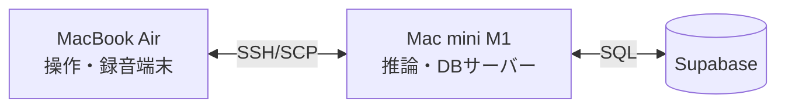

# あしあと（Ashiato）

**不登校児の社会復帰過程をAIで可視化。1万坪の里山を舞台とした広域連携モデルの実証**

フリースクール「あしあと」の活動セッションを、音声記録から教育的エビデンスへ自動変換するパイプラインです。

---

## 1. 社会的インパクトモデル（ロジックモデル）

### 最終目標
すべての子どもが「今の自分が大好きだ」と胸を張り、自らの人生に希望を持てる社会の実現

### セオリー・オブ・チェンジ（変化の理論）
この事業が「なぜ」社会を変えられるのか、その戦略的仮説です。

**【戦略の核】**
「だれも知らない街」での心の解放（アナログ）と、AIによる価値の翻訳（デジタル）を掛け合わせ、公教育との壁を突破する。

1.  **心理的リセット（匿名性の活用）**: 近隣の目が届かない「だれも知らない街」へ移動することで、監視されている感覚から子どもを解放し、自己回復のスイッチを入れる。
2.  **価値の橋渡し（AIの活用）**: 里山での「自由な遊び」を、AIが学校長が受理可能な「教育的成長」へと翻訳し、社会的な記録に変える。
3.  **社会との再接続（70名規模のコミュニティ）**: 多世代コミュニティへ合流することで、「自分は社会の中でやっていける」という自信を獲得させる。

### 主要ターゲットと課題の背景
- **不登校状態にある子ども**: 里山での豊かな育ちが、客観的な判断基準を持たないため社会的に「空白（欠席）」と扱われる不利益を解消する。
- **不登校児の保護者**: 世間体への葛藤、看護による経済的損失、孤立感を軽減する。
- **学校・教育委員会**: 学校外での学びを客観的に評価する情報を補完し、適切な教育的判断（出席扱い等）を支援する。

### インプット（投入資源）
- **人的資源**: 教員経験スタッフ、AI技術者、学生ボランティア（70名規模）
- **物的資源**: 1万坪の里山、独自AI解析サーバー（発話量、トーンの推移、笑い声の頻度等を抽出し情緒回復を定量化）
- **知見・マニュアル**: 兵庫県ガイドラインに基づく評価ノウハウ、広域連携三者間マニュアル

### アクティビティ（自立を促す3段階ステップ）
1.  **親子で体験**: 監視の目のない環境で安心を確保し、心を解放する。
2.  **単独通所**: スタッフの伴走のもと、自己決定の経験を積む。
3.  **社会への合流**: 70名規模の多世代現場で、対人関係への自信を再獲得する。
4.  **基盤（AI）**: 「輝き」の言語化。本人の同意のもと活動を解析し、学校長の判断を支援する成長レポートへ変換。

### アウトカム（短期・中期的な変化）
- **子ども**: 監視の目のない安心感から自信を回復し、次の学びへの意欲を持つ。
- **保護者**: 公的な「出席扱い」に関する情報提供により、経済的・心理的な救済を受ける。
- **学校**: 専門的な客観データに基づき、登校以外の学びを適切に評価・判断できる体制が整う。

### インパクト（長期的な社会変化）
- **「隠れる不登校」から「選ぶ不登校」へ**: 不登校を「問題」から「多様な学びの選択」へと社会の認識をアップデートする。
- **広域連携モデルの普及**: 「だれも知らない街」で回復し、社会へ戻る仕組みが、全国の不登校支援のインフラとなる。

### 成功の鍵（Key Success Factors）
- **「だれも知らない」という薬**: 広域移動による匿名性が安全基地として機能する点。
- **「混ざり合う社会」という出口戦略**: 不登校児だけの場に留まらない「多世代現場」が自立を促す点。
- **「判断を支える」エビデンス**: AIによる定量データが、学校現場の専門的な判断を技術的に補完する点。

---

## 2. システムアーキテクチャ

本システムは、プライバシー保護と処理能力の両立のため、**「手元のPC（MacBook Air）」**をコントローラーとし、**「ローカルサーバー（Mac mini）」**でAI推論とデータベース連携を行う構成を採用しています。

### ハードウェア・構成



- **MacBook Air**: 音声の転送、パイプラインの実行命令、成果物の閲覧。
- **Mac mini**:
    - **Whisper large-v3**: 日本語音声認識。
    - **Pyannote 3.1**: 話者分離（誰が話したかを特定）。
    - **Ollama (qwen2.5:7b)**: 分析・観点別記述の草稿生成。
    - **Supabase**: 教育的エビデンスの永続化。

---

## 3. 処理パイプライン

AIが「一次記録の整理」と「教育的フォーマットへの翻訳補助」を担い、最終確認を人間が行う **Human-in-the-loop** 設計です。

1.  **録音・転送**: 音声を MBA から Mac mini へ転送。
2.  **文字起こし（話者分離）**: 自動で話者を特定しながら CSV を生成。
3.  **話者マッピング**: `SPEAKER_00` 等を実名（児童/支援者）に紐付け（対話形式）。
4.  **切片化 (Stage 1)**: 発言を「指導要録」の3観点に自動分類。
5.  **報告書生成 (Stage 2)**: 分類されたエビデンスに基づき、校長・保護者向けの報告書を生成。
6.  **DB蓄積**: 抽出したエビデンスを Supabase へ保存。

---

## 4. 使い方

すべての操作は **MacBook Air のターミナル** から `ashiato.sh` を通じて行います。

### ステップ1: 文字起こし（話者分離対応）
Mac mini の GPU 資産を使い、自動で話者を分離しながら文字起こしを行います。
```bash
bash ashiato.sh transcribe <音声ファイル.wav>
# → transcripts/ フォルダに話者ラベル付き CSV が保存されます
```

### ステップ2: 話者マッピング
AI が分離した「話者ラベル」に名前を付けます。
```bash
python3 map_speakers.py <文字起こしされた.csv>
# 対話形式で SPEAKER_00 等に「太郎」「山田」などの名前を割り当てます
# → mapped_YYYYMMDD.csv が生成されます
```

### ステップ3: 切片化（Stage 1）
発言を教育的な観点別に分類します（Mac mini で実行されます）。
```bash
bash ashiato.sh segment <mapped.csv>
# → evidence_YYYYMMDD.json が生成されます（人間による内容確認が可能）
```

### ステップ4: 報告書生成・保存
最終的な報告書を作成し、DB へ同期します。
```bash
# 報告書の生成
bash ashiato.sh report evidence_*.json

# 成長記録の DB 保存（Supabase）
bash ashiato.sh store evidence_*.json
```

---

## 5. セットアップ

### Mac mini (サーバー側)
1.  リポジトリの配置: `~/scripts/ashiato`
2.  環境変数の設定: プロジェクトルートに `.env` を作成。
    ```env
    SUPABASE_DB_URL=postgresql://...
    ASHIATO_OLLAMA_URL=http://localhost:11434/api/generate
    ```
3.  文字起こしツールのセットアップ: `~/bin/audio-diarization-transcript`

---

## 6. プライバシーとデータ管理

- **ローカル完結**: すべての推論処理は Mac mini 内で完結。音声データ自体は外部サーバーへ送信されません。
- **ヒューマン・イン・ザ・ループ**: AI はあくまで「草稿」と「根拠の提示」を行い、最終的な確認・承認は現職教員または支援者が行います。
- **匿名化**: `map_speakers.py` 実行時に、報告書用の児童名を匿名化（児童A, Bなど）するオプションがあります。
